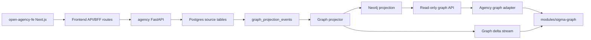
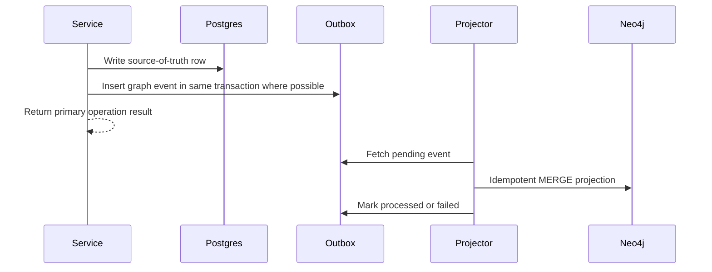

# Agency Graph Developer Guide

Last updated: 2026-07-03

This is the canonical developer guide for Agency's graph architecture: Postgres, Neo4j, Sigma.js, graph projection, runtime observability, and AI memory relationships.

It replaces the earlier migration planning documents under `docs/graph-architecture-migration/`. Those documents were useful during implementation planning, but developers should use this guide for current architecture, usage, maintenance, and extension work.

## Quick Checklist

- [x] Postgres remains the transactional source of truth.
- [x] Neo4j is a rebuildable graph projection and traversal layer.
- [x] Sigma is read-only visualization and observability.
- [x] React Flow remains the workflow editor.
- [x] Graph synchronization is event-driven through Postgres outbox rows.
- [x] Runtime execution must not depend on Neo4j availability.
- [x] Raw memory content, embeddings, secrets, credential data, and storage URIs must not be projected into Neo4j.
- [x] Large graph views must use bounded traversal, filtering, and progressive expansion.

## Mental Model

Agency has two graph concepts that must stay separate.

React Flow owns editable workflow graphs:

- Workflow design
- Node and edge editing
- Workflow configuration
- Structured orchestration definitions
- Execution configuration

The Sigma graph module owns read-only Agency Graph views:

- AI memory associations
- Entity relationships
- Document provenance
- Tool usage relationships
- Agent-to-agent and task relationships
- Execution lineage when queried through backend graph APIs
- Event-derived fallback graphs when Neo4j projection is unavailable or empty
- Temporal graph exploration
- Large-scale traversal visualization

Sigma must not become a workflow editor. Neo4j must not replace Postgres as the application database.

## Architecture Overview



The source-of-truth write path is still:

```text
FastAPI service/repository -> Postgres transaction -> optional graph outbox event
```

The graph read path is:

```text
Neo4j projection -> read-only graph API -> Agency DTO adapter -> SigmaGraphDocument -> Sigma renderer
```

The live update path is:

```text
projection event -> graph delta stream -> frontend proxy -> Sigma controller patch
```

## Repository Map

Frontend repo: sibling `open-agency-fe` checkout

| Area                                               | Purpose                                                                                                |
|----------------------------------------------------|--------------------------------------------------------------------------------------------------------|
| `modules/sigma-graph`                              | Reusable, Agency-neutral graph module with 2D Sigma and 3D force-graph renderers.                       |
| `lib/agency-graph`                                 | Agency-specific adapters, config, realtime helpers, and types.                                         |
| `lib/api/backend/graphRead.ts`                     | Frontend client for graph read endpoints.                                                              |
| `lib/api/backend/graphStream.ts`                   | Frontend client helpers for graph delta streaming.                                                     |
| `app/api/graph-stream/deltas/route.ts`             | Same-origin frontend proxy for graph stream auth/session behavior.                                     |
| `app/(protected)/memory-graph/page.tsx`            | Dedicated protected Agency Graph page. The route is retained for compatibility.                        |
| `components/agency-graph/AgencyGraphWorkspace.tsx` | Page-level graph status and memory-root loading.                                                       |
| `components/agency-graph/AgencyGraphPanel.tsx`     | Read-only Agency Graph panel with root focus, event fallback, compact filters, 2D/3D controls, legend, and inspector. |

Backend repo: `/Users/kehchinleong/Documents/Personal/Agency/agency`

| Area                                      | Purpose                                                 |
|-------------------------------------------|---------------------------------------------------------|
| `app/core/config.py`                      | Graph and Neo4j feature flags/config.                   |
| `app/db/models/graph_projection.py`       | Projection outbox/checkpoint/dead-letter models.        |
| `app/db/repositories/graph_projection.py` | Outbox repository helpers.                              |
| `app/domain/graph_projection.py`          | Graph projection event domain types.                    |
| `app/graph/projection.py`                 | Projection abstractions.                                |
| `app/graph/neo4j_projection.py`           | Neo4j schema, projector, Cypher writes.                 |
| `app/graph/neo4j_read.py`                 | Neo4j read models and traversal queries.                |
| `app/graph/service.py`                    | Read service helpers and traversal presets.             |
| `app/graph/rebuild.py`                    | Rebuild orchestration from outbox events.               |
| `app/graph/parity.py`                     | Outbox-to-Neo4j parity diagnostics.                     |
| `app/graph/delta.py`                      | Graph delta mapping.                                    |
| `app/api/routes/graph_projection.py`      | Projection status/replay API.                           |
| `app/api/routes/graph_read.py`            | Read-only graph traversal API.                          |
| `app/api/streaming/graph_sse.py`          | Graph delta stream.                                     |
| `app/services/memory.py`                  | Memory, compact, summary, document projection payloads. |
| `app/services/document_ingestion.py`      | Document ingestion and graph projection triggers.       |
| `app/services/entity_extraction.py`       | Feature-flagged entity extraction/resolution.           |

## Source Of Truth Boundary

Postgres remains authoritative for transactional application state.

Postgres stores:

- Users, permissions, application identity
- Workflow definitions and versions
- React Flow editor state
- Agents, tasks, tools, and configuration
- Workflow runs and structured execution records
- Execution logs/events
- Credential references
- Durable memories and document chunks
- pgvector embeddings and retrieval state
- Outbox projection events
- Application state and API transaction records

Neo4j stores a projection optimized for relationship traversal.

Neo4j stores:

- Agents and their relationships
- Workflow-to-agent/task/tool relationships
- Workflow run and step run lineage
- Tool invocation relationships
- Memory provenance
- Document and chunk associations
- Entity mentions and semantic associations
- Workflow memory links
- Cross-workflow associations
- Temporal graph structures for exploration

Neo4j must not store:

- Raw memory content
- Embeddings
- Secrets or credentials
- Credential references with sensitive values
- Storage URIs
- Full compact structured payloads
- Arbitrary non-allowlisted metadata
- Workflow editor writes

## Consistency Model

Graph projection is eventually consistent.

The transactional boundary is the Postgres write. If the primary write succeeds, the application behavior succeeds even if Neo4j is down. Projection events can be replayed later.



Rules:

- Emit projection events from the source service/repository where the source state is known.
- Use allowlisted payloads, never raw domain objects.
- Make Neo4j writes idempotent with deterministic IDs and `MERGE`.
- Treat failed projection as operational debt, not runtime failure.
- Use parity and rebuild commands to recover drift.

## Feature Flags

Backend flags live in `agency/.env.example` and `app/core/config.py`.

```text
GRAPH_PROJECTION_ENABLED=true
GRAPH_ENTITY_EXTRACTION_ENABLED=false
GRAPH_ENTITY_EXTRACTION_MIN_CONFIDENCE=0.7
GRAPH_DOCUMENT_PROJECTION_MAX_CHUNKS=500
NEO4J_ENABLED=false
NEO4J_URI=bolt://localhost:7687
NEO4J_USER=neo4j
NEO4J_PASSWORD=agency-neo4j-password
NEO4J_DATABASE=
```

Frontend flags live in `open-agency-fe/.env.example`.

```text
NEXT_PUBLIC_GRAPH_REALTIME_ENABLED=false
```

Rollout guidance:

- Enable `GRAPH_PROJECTION_ENABLED` first so outbox events are captured.
- Enable Neo4j locally or in staging with `NEO4J_ENABLED=true`.
- Keep entity extraction disabled until entity quality is acceptable.
- Enable `NEXT_PUBLIC_GRAPH_REALTIME_ENABLED=true` only after snapshot reads and stream auth pass smoke checks.

## Backend Projection Flow

Projection is based on event types persisted in the graph projection outbox. The backend emits events for execution, workflow memory links, memory lifecycle, document collections, compact summaries, daily summaries, and entity-related memory/document relationships.

When adding a new projection source:

1. Identify the Postgres source table or service method that owns the change.
2. Define a narrow graph event type in the outbox domain.
3. Emit an allowlisted payload, preferably in the same transaction as the source write.
4. Add projector handling in `app/graph/neo4j_projection.py`.
5. Use deterministic node and relationship IDs.
6. Add read coverage in `app/graph/neo4j_read.py` if the data should be traversable.
7. Add API/client/Sigma adapter support only after the projection model is stable.
8. Add tests for payload redaction, projection idempotency, read DTO shape, and parity expectations.

Projection payload rule:

```text
payload = minimum graph-safe fields needed for traversal and observability
```

Do not project the full source record.

## Neo4j Domain Model

Use PascalCase labels and SCREAMING_SNAKE_CASE relationship types.

Node ID convention:

```text
<Label>:<source-id>
```

Examples:

- `User:user-123`
- `Workflow:workflow-123`
- `WorkflowRun:run-123`
- `StepRun:step-123`
- `Memory:memory-123`
- `Document:document-123`
- `Entity:entity-normalized-name`

Common node properties:

| Property     | Meaning                                                |
|--------------|--------------------------------------------------------|
| `id`         | Deterministic graph ID.                                |
| `source_id`  | Original Postgres/source identifier.                   |
| `name`       | Human-readable name when available.                    |
| `label`      | Display label for graph UI.                            |
| `created_at` | Source creation timestamp.                             |
| `updated_at` | Source update timestamp.                               |
| `deleted_at` | Soft-delete timestamp when applicable.                 |
| `started_at` | Temporal interval start for runtime/memory provenance. |
| `ended_at`   | Temporal interval end.                                 |
| `source`     | Origin of projection when useful.                      |

Primary node labels:

| Label                | Use                                                                   |
|----------------------|-----------------------------------------------------------------------|
| `User`               | User ownership and actor provenance.                                  |
| `Agent`              | Agent definitions and runtime performers.                             |
| `Workflow`           | Workflow definition root.                                             |
| `WorkflowVersion`    | Versioned workflow snapshots when projected.                          |
| `Task`               | Workflow task/design node.                                            |
| `Tool`               | Tool definitions and invocations.                                     |
| `WorkflowMemory`     | Workflow memory definition/configuration.                             |
| `WorkflowMemoryLink` | Link between workflow memory and target scope.                        |
| `WorkflowRun`        | Runtime execution/run.                                                |
| `StepRun`            | Runtime step/task execution.                                          |
| `ExecutionEvent`     | Event-level runtime observability.                                    |
| `ToolInvocation`     | Tool call lineage.                                                    |
| `Memory`             | Durable memory, compact memory, daily summary, document chunk memory. |
| `Document`           | Ingested document collection.                                         |
| `Entity`             | Extracted/resolved semantic entity.                                   |
| `Conversation`       | Conversation scope/source context when projected.                     |

Primary relationship types:

| Relationship          | Direction                                             | Meaning                                   |
|-----------------------|-------------------------------------------------------|-------------------------------------------|
| `HAS_RUN`             | `Workflow -> WorkflowRun`                             | Workflow produced a run.                  |
| `RUN_OF`              | `WorkflowRun -> Workflow`                             | Reverse lineage convenience.              |
| `HAS_STEP_RUN`        | `WorkflowRun -> StepRun`                              | Run contains step execution.              |
| `DEFINES_AGENT`       | `Workflow -> Agent`                                   | Workflow references/defines an agent.     |
| `DEFINES_TASK`        | `Workflow -> Task`                                    | Workflow defines a task.                  |
| `DEFINES_TOOL`        | `Workflow -> Tool`                                    | Workflow references/defines a tool.       |
| `ASSIGNED_TO`         | `Task -> Agent`                                       | Task assignment.                          |
| `CAN_USE`             | `Agent -> Tool`                                       | Agent tool capability.                    |
| `USES_TOOL`           | `Task/StepRun -> Tool`                                | Design/runtime tool use.                  |
| `CALLED_TOOL`         | `ToolInvocation -> Tool`                              | Tool invocation target.                   |
| `INVOKED_IN_STEP`     | `ToolInvocation -> StepRun`                           | Invocation occurred in a step.            |
| `PERFORMED_BY`        | `StepRun -> Agent`                                    | Runtime performer.                        |
| `HAS_MEMORY_LINK`     | `Workflow -> WorkflowMemoryLink`                      | Workflow memory link definition.          |
| `LINKS_MEMORY`        | `WorkflowMemoryLink -> Memory`                        | Link target memory when known.            |
| `AVAILABLE_TO`        | `Memory/Document -> Workflow/Agent/Conversation/User` | Scope availability.                       |
| `SOURCE_DOCUMENT`     | `Memory -> Document`                                  | Memory created from a document.           |
| `HAS_CHUNK`           | `Document -> Memory`                                  | Document contains projected chunk memory. |
| `PART_OF_DOCUMENT`    | `Memory -> Document`                                  | Reverse chunk-to-document relationship.   |
| `OWNS_DOCUMENT`       | `User -> Document`                                    | Document owner.                           |
| `SOURCE_CONVERSATION` | `Memory -> Conversation`                              | Memory source conversation.               |
| `SOURCE_EXECUTION`    | `Memory -> WorkflowRun`                               | Memory source execution.                  |
| `SUPERSEDES`          | `Memory -> Memory`                                    | Memory replacement/supersession.          |
| `MENTIONS`            | `Memory/Document -> Entity`                           | Extracted entity mention.                 |

Temporal relationship properties:

| Property          | Meaning                                               |
|-------------------|-------------------------------------------------------|
| `created_at`      | Relationship creation time.                           |
| `started_at`      | Relationship interval start.                          |
| `ended_at`        | Relationship interval end.                            |
| `source_event_id` | Projection event source when useful.                  |
| `confidence`      | Entity extraction confidence.                         |
| `scope`           | Scope such as `workflow`, `agent`, or `conversation`. |

## Indexing And Constraints

Neo4j should have uniqueness constraints for deterministic IDs on projected labels.

Minimum expected constraints:

```cypher
CREATE CONSTRAINT agency_user_id IF NOT EXISTS FOR (n:User) REQUIRE n.id IS UNIQUE;
CREATE CONSTRAINT agency_agent_id IF NOT EXISTS FOR (n:Agent) REQUIRE n.id IS UNIQUE;
CREATE CONSTRAINT agency_workflow_id IF NOT EXISTS FOR (n:Workflow) REQUIRE n.id IS UNIQUE;
CREATE CONSTRAINT agency_workflow_run_id IF NOT EXISTS FOR (n:WorkflowRun) REQUIRE n.id IS UNIQUE;
CREATE CONSTRAINT agency_step_run_id IF NOT EXISTS FOR (n:StepRun) REQUIRE n.id IS UNIQUE;
CREATE CONSTRAINT agency_memory_id IF NOT EXISTS FOR (n:Memory) REQUIRE n.id IS UNIQUE;
CREATE CONSTRAINT agency_document_id IF NOT EXISTS FOR (n:Document) REQUIRE n.id IS UNIQUE;
CREATE CONSTRAINT agency_entity_id IF NOT EXISTS FOR (n:Entity) REQUIRE n.id IS UNIQUE;
```

Use `app/graph/neo4j_projection.py` as the source for the current schema bootstrap. Do not maintain separate production Cypher by hand unless it is generated from or reconciled with that module.

## Graph Read API

Backend graph read routes are read-only and require identity with `executions:read`.

Base prefix:

```text
/graph/read
```

Important endpoints:

| Endpoint                                               | Purpose                                              |
|--------------------------------------------------------|------------------------------------------------------|
| `GET /graph/read/status`                               | Check whether graph reads are enabled and available. |
| `GET /graph/read/nodes/{node_id}`                      | Fetch a single node by deterministic graph ID.       |
| `GET /graph/read/nodes/{node_id}/neighborhood`         | Generic bounded neighborhood traversal.              |
| `GET /graph/read/nodes/{node_id}/expand`               | Bounded expansion with optional preset.              |
| `GET /graph/read/search`                               | Search graph nodes.                                  |
| `GET /graph/read/workflows/{workflow_id}/neighborhood` | Workflow preset neighborhood.                        |
| `GET /graph/read/runs/{run_id}/neighborhood`           | Runtime run preset neighborhood.                     |
| `GET /graph/read/agents/{agent_id}/neighborhood`       | Agent preset neighborhood.                           |
| `GET /graph/read/tools/{tool_id}/neighborhood`         | Tool preset neighborhood.                            |
| `GET /graph/read/memories/{memory_id}/neighborhood`    | Memory preset neighborhood.                          |
| `GET /graph/read/entities/{entity_id}/neighborhood`    | Entity preset neighborhood.                          |
| `GET /graph/read/tasks/{task_id}/neighborhood`         | Task preset neighborhood.                            |
| `GET /graph/read/workflows/{workflow_id}/lineage`      | Workflow lineage view.                               |

Traversal limits:

```text
max expansion depth = 2
max expansion limit = 250
```

API responses use a graph document DTO:

```ts
interface AgencyGraphDocumentResponse {
  nodes: Array<{
    id: string;
    labels: string[];
    label?: string;
    properties: Record<string, unknown>;
  }>;
  edges: Array<{
    id: string;
    source: string;
    target: string;
    type: string;
    properties: Record<string, unknown>;
  }>;
  meta: Record<string, unknown>;
}
```

The frontend converts this DTO to `SigmaGraphDocument` through `lib/agency-graph/adapters.ts`, which delegates neutral normalization to `modules/sigma-graph/adapters/graphReadDto.ts`.

## Sigma Module

`modules/sigma-graph` is intentionally reusable and Agency-neutral. It must not import:

- Agency API clients
- Next.js routes
- React Flow code
- Workflow editor modules
- Backend-specific DTO types outside the neutral adapter boundary

Public module areas:

| File                       | Purpose                                                                                 |
|----------------------------|-----------------------------------------------------------------------------------------|
| `types.ts`                 | Renderer-neutral graph document, delta, filter, layout, realtime, and plugin contracts. |
| `normalize.ts`             | Document normalization and safety checks.                                               |
| `store.ts`                 | Framework-agnostic controller/store.                                                    |
| `filters.ts`               | Graph filtering helpers.                                                                |
| `clustering.ts`            | Cluster derivation.                                                                     |
| `temporal.ts`              | Temporal graph windowing.                                                               |
| `layout.ts`                | Layout engine abstraction and basic circle layout.                                      |
| `realtime.ts`              | WebSocket/EventSource delta adapter contracts.                                          |
| `SigmaGraphCanvas.tsx`     | Thin Sigma.js renderer boundary.                                                        |
| `adapters/graphReadDto.ts` | Neutral backend `nodes/edges/meta` DTO adapter.                                         |
| `fixtures/largeGraph.ts`   | Deterministic large graph fixture for performance tests.                                |

Core document contract:

```ts
export interface SigmaGraphDocument {
  schemaVersion: string;
  id?: string;
  title?: string;
  nodes: SigmaGraphNode[];
  edges: SigmaGraphEdge[];
  metadata?: Record<string, unknown>;
}

export interface SigmaGraphNode {
  id: string;
  type: string;
  label: string;
  size?: number;
  color?: string;
  position?: { x: number; y: number };
  clusterId?: string;
  startedAt?: string;
  endedAt?: string;
  data?: Record<string, unknown>;
  metadata?: Record<string, unknown>;
}

export interface SigmaGraphEdge {
  id: string;
  source: string;
  target: string;
  type: string;
  label?: string;
  size?: number;
  color?: string;
  startedAt?: string;
  endedAt?: string;
  data?: Record<string, unknown>;
  metadata?: Record<string, unknown>;
}
```

Minimal usage:

```tsx
'use client';

import SigmaGraphCanvas from '@/modules/sigma-graph/SigmaGraphCanvas';
import { graphReadDtoToSigmaGraph } from '@/modules/sigma-graph/adapters/graphReadDto';

export function AgencyGraphExample({ response }: { response: unknown }) {
  const document = graphReadDtoToSigmaGraph(response as never);
  return <SigmaGraphCanvas document={document} className="h-160 w-full" />;
}
```

In Agency UI code, prefer the Agency adapter:

```tsx
import { agencyGraphReadToSigmaGraph } from '@/lib/agency-graph/adapters';

const document = agencyGraphReadToSigmaGraph(graphReadResponse);
```

## Frontend Integration

Current graph surfaces:

- `/memory-graph` for the dedicated Agency Graph page. The path name is historical and kept for compatibility.
- `AgencyGraphPanel` for the user-facing Agency Graph canvas, controls, legend, and inspector.

The product-facing Sigma graph is mounted as a single dedicated protected page at `/memory-graph`. It is read-only and
should degrade without changing primary runtime or memory behavior. Runtime graph data can still be projected and queried
by backend APIs, but the run detail page does not expose a Sigma graph panel. The page is always routable for
authenticated users; backend graph availability is controlled by `NEO4J_ENABLED` and the graph projection state.

### Current Product Behavior

The current Agency Graph UX has been simplified from the original broad investigation-control design:

- The default root focus is `All`, which can merge an available memory projection with recent run/event fallback data.
- Users can narrow root focus to Memory, Run, or Workflow from the primary segmented control. Agent, Entity, Document,
  and Error roots are direct-ID choices for users who already know the record id.
- The default filter popover exposes only root focus/search, direct-ID roots, run status, graph text search, optional
  status/severity/relationship filters, clear filters, and compact active/truncation/runtime badges.
- Fallback source labels, raw event counts, recent-run counts, workflow counts, issue counts, and projection-mode badges
  are intentionally excluded from the filter popover.
- Advanced presets, timeline controls, clustering controls, dense diagnostics, and temporal filters are intentionally
  hidden from the default UI. The underlying code still contains some helpers for future graph workflows, but they are
  not product surface until there is clearer usage feedback.
- Toolbar-level view controls are exposed separately from filters: Overview, Links, Focus, 2D/3D, renderer-specific
  motion controls, refresh, and fullscreen.
- The always-visible table side panel was removed. Dense tables for recent runs, event lists, memories, entities,
  findings, and search results are deferred.
- The graph legend is compact and explains category colors, status rings, and edge line tones.
- The selection inspector is the primary place for detail. It is scrollable, shows source links when possible, and keeps
  raw backend node labels available after a user clicks a node.

### Performance And Reliability Budgets

The frontend applies bounded rendering before a graph reaches Sigma:

| Budget                            | Current frontend value |
|-----------------------------------|------------------------|
| Neighborhood query depth          | `2`                    |
| Neighborhood query node limit     | `250`                  |
| Rendered node budget              | `250`                  |
| Rendered edge budget              | `500`                  |
| Event fallback graph event budget | `120` events per run   |
| Label budget                      | `80` characters        |
| Graph/status cache                | 30 seconds             |
| Root option cache                 | 60 seconds             |

When a projected response or local fallback graph exceeds those budgets, the panel preserves higher-signal nodes first:
root-like nodes, failures, warnings, issue nodes, non-event domain nodes, and larger nodes. Edges are kept only when both
endpoints remain visible, with failure/provenance/operational edges prioritized. The filter popover shows a truncation
badge so users know the canvas is a bounded view, not the full graph.

Event fallback remains intentionally bounded. The fallback keeps failure/error events, early events, late events, and an
even sample through the run timeline. Repetitive event nodes are still condensed from the default canvas and summarized
in the selected parent inspector.

### Troubleshooting

Use `/graph/read/status` first:

```bash
curl http://127.0.0.1:8000/graph/read/status
```

Common states:

| State             | Meaning                                     | User-facing behavior                                                                     |
|-------------------|---------------------------------------------|------------------------------------------------------------------------------------------|
| `enabled:false`   | Graph read is disabled in backend config.   | Agency Graph shows disabled status and can still use run event fallback.                 |
| `available:false` | Neo4j or projection read is unavailable.    | Agency Graph shows unavailable status and can still use run event fallback.              |
| Empty projection  | Query worked but returned no nodes.         | Agency Graph shows an empty projection message and can fall back for run/workflow roots. |
| Truncated graph   | Backend or frontend budget capped the view. | Agency Graph shows a truncation badge and keeps the highest-signal records visible.      |

Local Neo4j settings live in the backend repo. The frontend only needs the backend API origin and an authenticated
session; Neo4j credentials are backend-only:

```text
NEO4J_ENABLED=true
NEO4J_URI=bolt://localhost:7687
NEO4J_USER=neo4j
NEO4J_PASSWORD=agency-neo4j-password
NEO4J_DATABASE=
```

Relevant frontend checks:

```bash
node node_modules/vitest/vitest.mjs run components/agency-graph/AgencyGraphPanel.test.tsx components/agency-graph/AgencyGraphWorkspace.test.tsx modules/sigma-graph/performanceBudget.test.ts
node node_modules/vitest/vitest.mjs run modules/sigma-graph/ForceGraph3DCanvas.test.ts
node node_modules/typescript/bin/tsc --noEmit
node node_modules/eslint/bin/eslint.js components/agency-graph lib/agency-graph lib/api/backend/graphRead.ts modules/sigma-graph
```
- Repetitive execution event nodes are condensed out of the default canvas. Their counts and grouped summaries are shown
  in the selected parent node inspector.
- The graph was smoke-tested across desktop `1280x900`, wide desktop `1600x1000`, tablet `768x900`, mobile `390x844`,
  and fullscreen `1280x900` viewports.

### Display Categories

The canonical graph model still accepts detailed node labels, but the user-facing filter and legend use a smaller
category layer:

| Display category | Representative raw node labels                                                                                                               |
|------------------|----------------------------------------------------------------------------------------------------------------------------------------------|
| Agent            | `Agent`, `User`                                                                                                                              |
| Workflow         | `Workflow`, `WorkflowVersion`, `Schedule`                                                                                                    |
| Run              | `Run`, `WorkflowRun`, `StepRun`, `Task`                                                                                                      |
| Event            | `ExecutionEvent`, `ContainerEvent`                                                                                                           |
| Tooling          | `Tool`, `ToolCall`, `Model`, `ModelProvider`, `ModelRequest`, `RuntimeRevision`, `RuntimeContainer`, `Artifact`, `Integration`, `Credential` |
| Knowledge        | `Memory`, `ContextPack`, `Conversation`, `Message`, `Document`, `DocumentChunk`, `Entity`, `Decision`, `Constraint`, `OpenQuestion`          |
| Issue            | `Error`, `Finding`, `ApprovalRequest`                                                                                                        |
| Other            | Unknown or future labels until explicitly categorized                                                                                        |

Display categories are a presentation layer only. Do not replace canonical backend labels or projection labels with these
categories in persisted graph data.

### Event Fallback And Condensation

When Neo4j projection is disabled, unavailable, or returns no useful graph for a supported root, the frontend can build a
temporary graph from:

- `/executions`
- `/observability/executions/{executionId}/timeline`
- `/executions/{executionId}/events`

This fallback is intentionally not a durable Neo4j projection. It gives users immediate visibility into failed or partial
runs while backend projection/backfill work remains pending.

Event nodes are intentionally hidden from the default canvas because hundreds of repeated event nodes make the graph hard
to navigate. The data is still loaded and summarized:

- The filter popover stays compact and should not show fallback-source labels, raw event totals, recent-run totals, or
  projection diagnostics.
- Source, coverage, live-state, and truncation diagnostics belong in the status tooltip or a future dedicated diagnostics
  page, not in the filter controls.
- Parent nodes such as Run, Agent, RuntimeContainer, Task, ToolCall, and ModelRequest can show grouped event summaries in
  the inspector.
- Raw event node labels such as `ExecutionEvent` and `ContainerEvent` should not appear as primary default filters or
  legend entries.

### 2D And 3D Rendering

Agency Graph exposes two renderers over the same filtered graph document:

- `SigmaGraphCanvas` is the 2D constellation renderer. It supports the flattened asteroid/comet atmosphere, selection,
  view filtering, rotation, and realtime patches.
- `ForceGraph3DCanvas` is the 3D constellation renderer. It supports compact seeded layout, orbit pause/resume, reset
  view, atmospheric dust/comets, link particles, and zoom-tiered visual detail.
- 3D camera/orbit motion must not reheat the force simulation or rebuild graph data on every animation frame. Keep
  camera distance in refs for frame-by-frame movement and commit React state only at coarse thresholds or intentional
  camera jumps.
- 3D may aggregate dense workflow runs into synthetic visual clusters at overview/mid distances, but the canonical panel
  document, filters, counts, and inspector remain grounded in source graph records.

### Deferred Or Changed Work

The following items were deliberately changed or deferred from earlier planning:

- Table side panels are deferred until user feedback shows which dense workflows need them.
- Advanced graph controls are hidden from the default UI rather than exposed all at once. The exposed toolbar is limited
  to status, filters, Overview/Links/Focus, 2D/3D, renderer-specific motion controls, refresh, and fullscreen.
- Search/path/analytics endpoints remain future work.
- Durable backend projection writes, backfills, and projection health remain Phase 4 work.
- Route migration from `/memory-graph` is not implemented; keep the compatibility route unless a redirect plan is agreed.
- The former standalone graph checklist tracker is retired. Keep remaining release validation and future graph work in
  this document under `TODO Next`.

When adding a new graph panel:

1. Add the backend read endpoint or reuse a preset neighborhood endpoint.
2. Add a typed client method in `lib/api/backend/graphRead.ts`.
3. Convert the backend DTO with `agencyGraphReadToSigmaGraph`.
4. Render with `SigmaGraphCanvas` or an existing panel pattern.
5. Keep view-specific controls outside `modules/sigma-graph`.
6. Add tests for loading, empty state, filters, selection, truncation, and unavailable-backend behavior.

Do not add workflow editing commands, node mutation commands, or edge mutation commands to Sigma panels.

## Realtime Graph Updates

Realtime graph updates are optional and separately gated.

```text
NEXT_PUBLIC_GRAPH_REALTIME_ENABLED=true
```

The current route shape:

```text
Frontend EventSource -> /api/graph-stream/deltas -> backend /graph/stream/deltas
```

Rules:

- Load the snapshot before applying stream deltas.
- Resume reconnects with the last observed delta event ID.
- Refresh the snapshot after reconnect.
- Keep stream auth stricter than local development defaults.
- Disable realtime independently if stream behavior is unstable.
- Consume realtime only from bounded graph surfaces that already load a snapshot first. Agency Graph shows live/offline
  status in the graph status tooltip when `NEXT_PUBLIC_GRAPH_REALTIME_ENABLED=true`.

The Sigma controller applies realtime updates through `SigmaGraphDelta`:

```ts
interface SigmaGraphDelta {
  upsertNodes?: SigmaGraphNode[];
  upsertEdges?: SigmaGraphEdge[];
  removeNodeIds?: string[];
  removeEdgeIds?: string[];
  metadata?: Record<string, unknown>;
}
```

Agency Graph also reconciles streamed deltas with snapshot reloads by:

- Using the last observed delta event ID as the reconnect cursor.
- Treating the snapshot as authoritative when the user refreshes.
- De-duplicating fallback event nodes against projected nodes that share the same source record where possible.
- Keeping event-derived fallback available only as runtime evidence, not as a replacement projection.

## Local Development

Start Neo4j from the backend repo:

```bash
cd /Users/kehchinleong/Documents/Personal/Agency/agency
docker compose --profile graph up -d neo4j
docker compose ps neo4j
```

Run a dry rebuild:

```bash
NEO4J_ENABLED=true ./.venv/bin/python -m app.cli graph-projection rebuild-neo4j --dry-run
```

Clear and replay projection:

```bash
NEO4J_ENABLED=true ./.venv/bin/python -m app.cli graph-projection rebuild-neo4j --clear --confirm-clear --batch-size 100
```

Check parity:

```bash
NEO4J_ENABLED=true ./.venv/bin/python -m app.cli graph-projection parity --json
```

Expected parity shape:

```json
{
  "ok": true,
  "pending_count": 0,
  "failed_count": 0
}
```

Operational monitoring should track:

- Projection lag: oldest pending outbox event age and pending event count.
- Projection failures: failed outbox count, retry count, and latest failure message.
- Neo4j health: connection availability, query latency, and constraint/index readiness.
- Rebuild safety: dry-run counts, clear/replay job id, and parity status after rebuild.
- Frontend symptoms: `/graph/read/status` unavailable, graph request failures, and repeated fallback usage.

Run backend graph tests:

```bash
cd /Users/kehchinleong/Documents/Personal/Agency/agency
./.venv/bin/python -m unittest \
  tests.test_entity_extraction \
  tests.test_memory_service \
  tests.test_memory_api \
  tests.test_document_ingestion \
  tests.test_workflow_memory_links \
  tests.test_graph_read_api \
  tests.test_neo4j_graph_read \
  tests.test_neo4j_graph_projection \
  tests.test_graph_parity
```

Run frontend graph tests:

```bash
cd ../open-agency-fe
npm test -- \
  modules/sigma-graph \
  lib/agency-graph \
  components/agency-graph \
  lib/api/backend/graphRead.test.ts
```

Run frontend typecheck:

```bash
npm run typecheck
```

## Operations Checklist

Before enabling graph visualization in an environment:

- [ ] Neo4j container/service is healthy.
- [ ] `GRAPH_PROJECTION_ENABLED=true`.
- [ ] `NEO4J_ENABLED=true`.
- [ ] Projection rebuild has completed with zero failures.
- [ ] Parity reports `ok=true`.
- [ ] Read API status reports available.
- [ ] Memory graph loads a bounded graph.
- [ ] Existing React Flow workflow editing still works.
- [ ] Existing pgvector memory retrieval still works.

## Rollback

Immediate frontend rollback:

```text
NEXT_PUBLIC_GRAPH_REALTIME_ENABLED=false
```

Immediate backend rollback:

```text
GRAPH_ENTITY_EXTRACTION_ENABLED=false
NEO4J_ENABLED=false
```

Full projection emission rollback:

```text
GRAPH_PROJECTION_ENABLED=false
```

Use full projection rollback only when outbox event emission itself is causing problems. For Neo4j read/projector problems, disabling `NEO4J_ENABLED` is usually enough because Postgres source-of-truth behavior remains intact.

Rollback rules:

- Disable frontend graph surfaces first if users are affected.
- Disable realtime independently from snapshot graph reads.
- Disable entity extraction independently if entity quality is the issue.
- Do not delete or mutate Postgres source tables for graph rollback.
- Clear Neo4j projected labels only after confirming the problem is projection data quality.

## Troubleshooting

Projection parity drift:

- Run parity with `--json`.
- Inspect pending and failed outbox event IDs.
- Fix the projector or payload issue.
- Replay failed events or rebuild from the outbox.

Graph read API unavailable:

- Check `NEO4J_ENABLED`.
- Check Neo4j service health.
- Check Bolt credentials and database name.
- Check whether projection has been rebuilt.
- Confirm frontend graph surfaces degrade without breaking primary UI.

Document graph too dense:

- Lower `GRAPH_DOCUMENT_PROJECTION_MAX_CHUNKS`.
- Rebuild Neo4j projection.
- Verify `projected_chunk_count` and `omitted_chunk_count`.
- Leave Postgres document chunk storage unchanged.

Entity graph too noisy:

- Raise `GRAPH_ENTITY_EXTRACTION_MIN_CONFIDENCE`.
- Disable `GRAPH_ENTITY_EXTRACTION_ENABLED` if needed.
- Rebuild entity projection after extractor changes.

Realtime instability:

- Disable `NEXT_PUBLIC_GRAPH_REALTIME_ENABLED`.
- Keep snapshot graph reads enabled if stable.
- Validate stream auth, reconnect, and snapshot reconciliation before re-enabling.

## How To Add A Node Or Relationship

Use this checklist for any new graph model change.

- [ ] Confirm the data is relationship/traversal data and belongs in Neo4j.
- [ ] Confirm Postgres remains the source of truth.
- [ ] Define the node label or relationship type using naming standards.
- [ ] Choose deterministic IDs.
- [ ] Add only graph-safe properties.
- [ ] Add or update Neo4j constraints/indexes.
- [ ] Emit an outbox event from the source write path.
- [ ] Add idempotent projection Cypher.
- [ ] Add read DTO mapping if the data is visible through API.
- [ ] Add frontend adapter or panel behavior only if a user-facing graph needs it.
- [ ] Add tests for projection, redaction, idempotency, traversal, and UI behavior.
- [ ] Add parity/rebuild expectations if counts should be monitored.

Good candidates for Neo4j:

- "What memories mention this entity?"
- "Which workflows used this tool?"
- "What run created this memory?"
- "Which document chunks are available to this workflow?"
- "Which agents are connected through handoff/tool/task behavior?"

Poor candidates for Neo4j:

- Editing workflow definitions
- Credential lookup
- Transactional authorization decisions
- Raw memory retrieval
- Vector similarity search
- Application configuration
- UI state persistence

## Query Examples

Runtime lineage for a run:

```cypher
MATCH (run:WorkflowRun {source_id: $run_id})
OPTIONAL MATCH (run)-[:HAS_STEP_RUN]->(step:StepRun)
OPTIONAL MATCH (step)-[:PERFORMED_BY]->(agent:Agent)
OPTIONAL MATCH (step)-[:USES_TOOL|CALLED_TOOL]->(tool:Tool)
RETURN run, collect(DISTINCT step) AS steps, collect(DISTINCT agent) AS agents, collect(DISTINCT tool) AS tools
```

Memory provenance:

```cypher
MATCH (memory:Memory {source_id: $memory_id})
OPTIONAL MATCH (memory)-[:SOURCE_CONVERSATION]->(conversation:Conversation)
OPTIONAL MATCH (memory)-[:SOURCE_EXECUTION]->(run:WorkflowRun)
OPTIONAL MATCH (memory)-[:SOURCE_DOCUMENT|PART_OF_DOCUMENT]->(document:Document)
OPTIONAL MATCH (memory)-[:MENTIONS]->(entity:Entity)
RETURN memory, conversation, run, document, collect(entity) AS entities
```

Documents available to a workflow:

```cypher
MATCH (workflow:Workflow {source_id: $workflow_id})
MATCH (document:Document)-[:AVAILABLE_TO {scope: "workflow"}]->(workflow)
OPTIONAL MATCH (document)-[:HAS_CHUNK]->(chunk:Memory)
RETURN document, count(chunk) AS projected_chunks
ORDER BY document.updated_at DESC
```

Tool usage across workflows:

```cypher
MATCH (tool:Tool)<-[:USES_TOOL|CALLED_TOOL]-(usage)
OPTIONAL MATCH (workflow:Workflow)-[:HAS_RUN]->(:WorkflowRun)-[:HAS_STEP_RUN]->(usage)
RETURN tool, count(usage) AS usage_count, collect(DISTINCT workflow.source_id) AS workflows
ORDER BY usage_count DESC
```

Entity memory neighborhood:

```cypher
MATCH (entity:Entity {source_id: $entity_id})<-[:MENTIONS]-(memory:Memory)
OPTIONAL MATCH (memory)-[:SOURCE_DOCUMENT|PART_OF_DOCUMENT]->(document:Document)
OPTIONAL MATCH (memory)-[:AVAILABLE_TO]->(scope)
RETURN entity, collect(DISTINCT memory) AS memories, collect(DISTINCT document) AS documents, collect(DISTINCT scope) AS scopes
```

## Testing Matrix

Backend:

| Test area              | Expected coverage                                       |
|------------------------|---------------------------------------------------------|
| Outbox repository      | Event insert, replay, failure state, status.            |
| Projection payloads    | Allowlist/redaction, no raw content, no embeddings.     |
| Neo4j projector        | Idempotent `MERGE`, constraints, relationship creation. |
| Graph read API         | Auth, disabled state, bounded traversal, DTO shape.     |
| Parity/rebuild         | Dry run, clear/replay, drift diagnostics.               |
| Memory/document/entity | Provenance, chunk caps, entity confidence thresholds.   |

Frontend:

| Test area             | Expected coverage                                                                                     |
|-----------------------|-------------------------------------------------------------------------------------------------------|
| Sigma module boundary | No Agency/Next/React Flow imports in reusable module.                                                 |
| Normalization         | Stable node/edge IDs, temporal mapping, safe metadata.                                                |
| Store/controller      | Load, patch, selection, filtering, time windows.                                                      |
| Rendering             | Nonblank canvas smoke, inspector, controls.                                                           |
| Realtime              | EventSource/WebSocket adapters, reconnect, snapshot reconciliation.                                   |
| Panels                | Agency Graph loading, filters, selection expansion, truncation indicators, and slow-backend behavior. |

## Cleanup Status

The frontend cleanup state after the Agency Graph rename:

- `components/agency-graph` uses `AgencyGraph*` filenames and public component names.
- The compatibility route remains `/memory-graph`, but route internals and user-facing labels use Agency Graph wording.
- `AgencyGraphPanel` no longer carries the removed graph mode, path preset, timeline, clustering, or relationship-focus state.
- `AgencyGraphPanel` keeps filter controls compact; fallback source labels, recent-run counts, workflow counts, issue
  counts, and projection-mode badges were removed from the filter popover.
- The current visual controls are toolbar-level view modes plus 2D/3D renderer controls, not advanced filter controls.
- Query keys use Agency Graph naming for status and selected-node expansion.
- Event payloads and metrics are deferred out of the default graph document; inspector detail is the intended place for heavy data.
- Realtime helpers expose only the direct URL builder and hook used by the graph surface; wrapper aliases without callers were removed.
- Domain-model lookup sets are private implementation details; only canonical arrays, validators, metadata helpers, and public types are exported.

Retained but intentionally deferred:

- The backend route registry still lists graph search, path-like lineage, tool, and task endpoints because it documents the backend route surface, even though the simplified Agency Graph UI does not expose those controls. Frontend API wrapper methods are kept only for currently used graph surface calls.
- `/memory-graph` remains the route until a separate route migration and redirect plan is implemented.
- Backend projection, governance, and browser visual validation are tracked below as deferred work rather than frontend dead code.

## TODO Next

These are forward-looking work items, not blockers for the completed graph migration.

### Release Validation

- [ ] Browser-check `/memory-graph` when Neo4j is unavailable.
- [ ] Browser-check `/memory-graph` when there are no active memories.
- [ ] Confirm `/observability/executions/{executionId}/graph` reports unavailable when Neo4j projection is intentionally unavailable; the last local check returned `available:true` because Neo4j was connected.
- [ ] Add browser-level large graph performance coverage for the production graph panels, using seeded large graph fixtures and explicit render/interactivity budgets.
- [ ] Capture desktop, mobile, fullscreen, dense graph, and empty-state screenshots from seeded data before production release.

### Backend Projection

- [ ] Finish the durable backend projection pipeline in the backend repository: outbox replay, idempotent Neo4j writes, backfill jobs, parity checks, and rebuild runbooks.
- [ ] Add or confirm Neo4j constraints/indexes for node id, node type, user/workspace scope, source record id, timestamp, and relationship type.
- [ ] Define production Neo4j operations policy: backup/restore, monitoring, capacity thresholds, alerting, and rebuild runbooks for managed or self-hosted deployments.
- [ ] Validate projection counts in staging before production enablement.

### Query Layer

- [ ] Add graph search endpoints for node label, id, error text, memory summary/content, entity, workflow, agent, and tool.
- [ ] Add graph path endpoints for shortest path, memory provenance, failure root-cause signals, and document/entity influence paths.
- [ ] Add graph analytics endpoints for failure hotspots, repeated error clusters, stale memories, missing embeddings, expensive model paths, and frequently referenced entities.
- [ ] Add natural-language graph questions only after constrained graph query endpoints can return evidence paths with source-node citations.

### Governance

- [ ] Decide whether graph authorization should stay on `executions:read` or split into dedicated graph scopes such as `graph:read` and `agency_graph:read`.
- [ ] Enforce graph access control by authenticated user, workspace, workflow permissions, and credential/integration visibility.
- [ ] Protect sensitive graph data: no raw secrets, no credential values, redacted payload fields, marked sensitive memories, and hidden sensitive nodes unless explicitly allowed.
- [ ] Track projection source, projection version, projection timestamp, backfill job id, and source record id for auditability.
- [ ] Honor memory, document, user, and workspace deletion; support soft-deleted graph nodes only when `include_deleted=true`; prune event-derived graph data according to retention policy.
- [ ] Keep inspector actions read-only by default and require explicit confirmation outside the graph for any future mutation.

### Product Follow-Ups

- [ ] Add table side panels for dense workflows only if user feedback proves they are needed: recent runs, events, memories, entities, findings, and search results.
- [ ] Add Sigma plugins only when product usage justifies them; the current module already includes reusable filtering, clustering, temporal, layout, realtime, and plugin boundaries.
- [ ] Move these deferred items into the project issue tracker when the team is ready to schedule them.

## Maintenance Rules

- Keep graph code additive and reversible.
- Keep source writes independent from Neo4j.
- Keep projection payloads small and explicit.
- Prefer graph projection events over direct Neo4j writes from domain services.
- Keep `modules/sigma-graph` reusable and framework-light.
- Keep Agency-specific code in `lib/agency-graph` or app/components.
- Keep traversal endpoints bounded.
- Update this guide when adding labels, relationship types, flags, CLI commands, or graph surfaces.

## Anti-Patterns

Do not:

- Use Neo4j as the workflow source of truth.
- Use Sigma as a workflow editor.
- Store raw memory content or embeddings in Neo4j.
- Project arbitrary JSON metadata without an allowlist.
- Make runtime execution fail because graph projection failed.
- Add unbounded graph traversal endpoints.
- Put Agency API client imports inside `modules/sigma-graph`.
- Add graph write APIs for UI editing.
- Depend on realtime deltas as the only source of graph truth.
