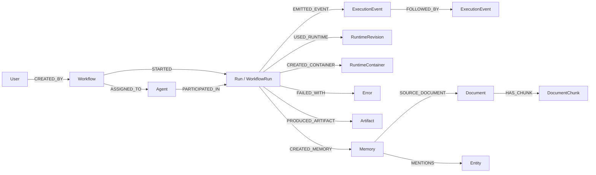
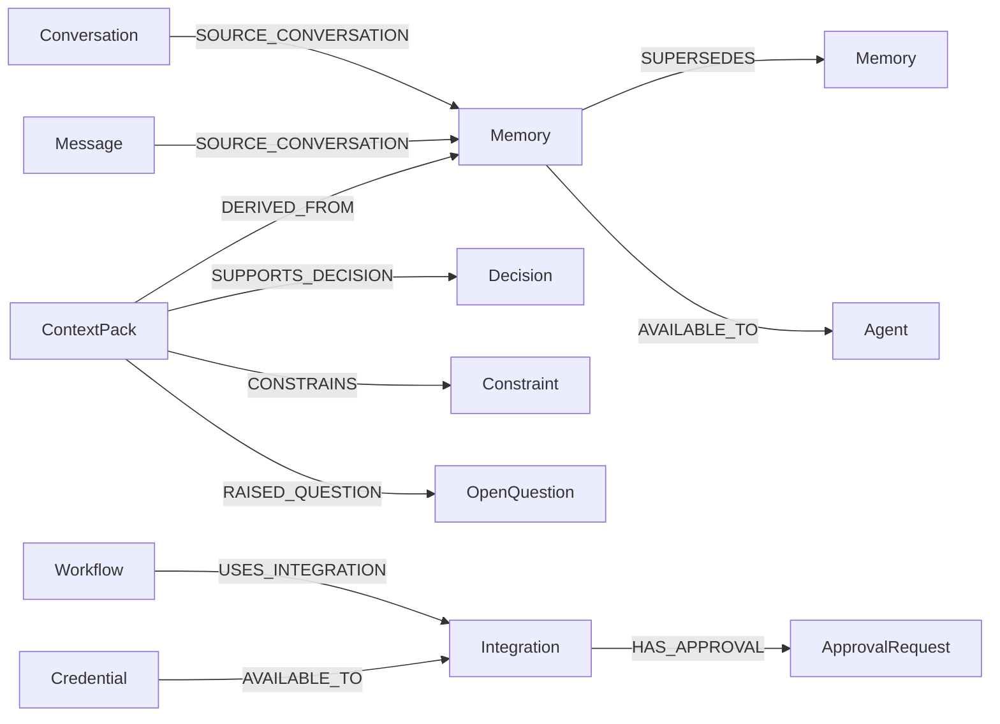
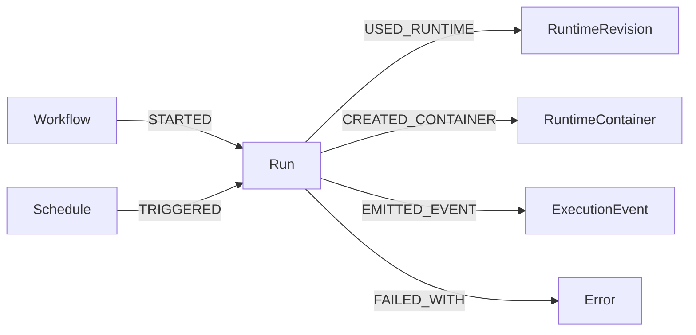
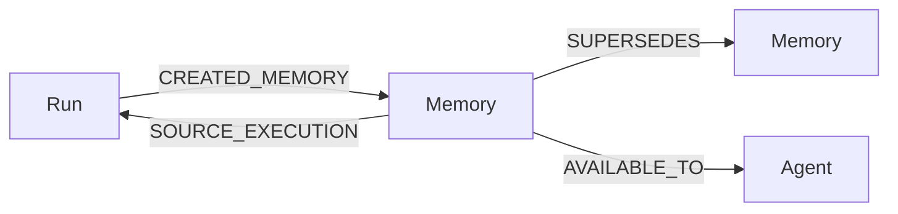
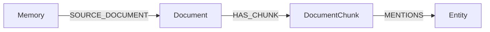
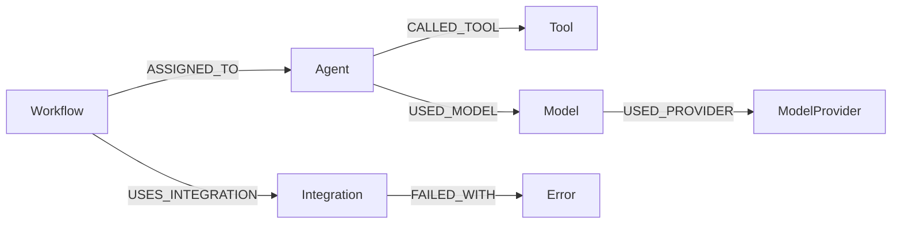

# Agency Graph Domain Model

Agency Graph is the shared graph language for operational telemetry, workflow lineage, memory provenance, documents, entities, and health signals. The canonical vocabulary lives in `domainModel.ts` so frontend adapters, backend projections, tests, and docs use the same names.

The canonical model is intentionally more detailed than the default UI. The `/memory-graph` page currently presents a
smaller category layer for visual colors, legends, and inspector summaries so users do not have to reason about every
backend label.

## Core Shape

## Knowledge And Governance Shape

## Node Types

| Type               | Purpose                                                                                       |
| ------------------ | --------------------------------------------------------------------------------------------- |
| `User`             | Actor that owns, starts, approves, or changes Agency records.                                 |
| `Workflow`         | Canonical workflow definition.                                                                |
| `WorkflowVersion`  | Versioned workflow snapshot used for lineage and rollback.                                    |
| `Run`              | Canonical execution run. `WorkflowRun` remains accepted for backend projection compatibility. |
| `StepRun`          | Task-scoped runtime execution detail from projection parity and run graphs.                   |
| `Schedule`         | Automation or schedule that triggers a run.                                                   |
| `Agent`            | Agent definition or runtime participant.                                                      |
| `Task`             | Workflow task, node, or task-scoped runtime unit.                                             |
| `Tool`             | Callable tool or connector capability.                                                        |
| `ToolCall`         | Individual tool invocation or tool span.                                                      |
| `ModelProvider`    | Provider namespace such as OpenAI, Azure, or local runtime.                                   |
| `Model`            | Specific model profile or model identifier.                                                   |
| `ModelRequest`     | Individual model call or request span.                                                        |
| `RuntimeRevision`  | Runtime adapter revision, image, or fingerprint.                                              |
| `RuntimeContainer` | Runtime container or local execution process envelope.                                        |
| `ExecutionEvent`   | Ordered execution event.                                                                      |
| `ContainerEvent`   | Container lifecycle event.                                                                    |
| `Artifact`         | Output artifact, file, generated report, or persisted run product.                            |
| `Memory`           | Durable memory record.                                                                        |
| `ContextPack`      | Summarized context or compact pack.                                                           |
| `Conversation`     | Conversation source for messages or memories.                                                 |
| `Message`          | Individual conversation message.                                                              |
| `Document`         | Uploaded, ingested, or source document.                                                       |
| `DocumentChunk`    | Chunk extracted from a document.                                                              |
| `Entity`           | Extracted person, organization, project, concept, or other named entity.                      |
| `Decision`         | Extracted or explicit decision.                                                               |
| `Constraint`       | Rule, limitation, requirement, or standing instruction.                                       |
| `OpenQuestion`     | Unresolved question or ambiguity.                                                             |
| `Error`            | Failure, exception, health issue, or runtime error summary.                                   |
| `Finding`          | Observation, review finding, or diagnostic result.                                            |
| `ApprovalRequest`  | Human approval or policy gate.                                                                |
| `Integration`      | External system, connector, MCP server, or adapter.                                           |
| `Credential`       | Credential reference or credential health node. Sensitive values are never stored.            |

## User-Facing Display Categories

The frontend groups detailed node labels into fewer display categories for visual encoding and summaries:

| Category  | Raw labels                                                                                                                                   |
| --------- | -------------------------------------------------------------------------------------------------------------------------------------------- |
| Agent     | `Agent`, `User`                                                                                                                              |
| Workflow  | `Workflow`, `WorkflowVersion`, `Schedule`                                                                                                    |
| Run       | `Run`, `WorkflowRun`, `StepRun`, `Task`                                                                                                      |
| Event     | `ExecutionEvent`, `ContainerEvent`                                                                                                           |
| Tooling   | `Tool`, `ToolCall`, `ModelProvider`, `Model`, `ModelRequest`, `RuntimeRevision`, `RuntimeContainer`, `Artifact`, `Integration`, `Credential` |
| Knowledge | `Memory`, `ContextPack`, `Conversation`, `Message`, `Document`, `DocumentChunk`, `Entity`, `Decision`, `Constraint`, `OpenQuestion`          |
| Issue     | `Error`, `Finding`, `ApprovalRequest`                                                                                                        |
| Other     | Unknown or future labels until explicitly mapped.                                                                                            |

These categories are display-only. Keep persisted graph nodes on the canonical labels above so read APIs, projection
parity, and backend traversals stay precise.

## Current UI Condensation Rules

The default Agency Graph canvas intentionally hides repetitive `Event` category nodes. Execution events remain part of
the fallback graph document, but the canvas filters them out and exposes grouped summaries in the selected parent node
inspector.

This is a UX choice, not a domain-model removal:

- `ExecutionEvent` and `ContainerEvent` remain canonical node types.
- `EMITTED_EVENT`, `FOLLOWED_BY`, and `PARENT_OF` remain canonical relationship types.
- Event fallback still preserves event sequence, timestamps, status, task/tool/model ids, and source record ids.
- Heavy event payloads and metrics are deferred out of the default graph document and should be surfaced only in the
  selected-node inspector.
- The default visual surface avoids event-node noise until a user clicks a relevant parent node.
- Filter controls should stay compact and avoid exposing fallback source labels, raw event totals, recent-run totals, or
  projection diagnostics. Put those details in the status tooltip, inspector, or a dedicated diagnostics surface.

## Relationship Types

| Type                  | Meaning                                                                 |
| --------------------- | ----------------------------------------------------------------------- |
| `CREATED_BY`          | Record was created by a user or actor.                                  |
| `STARTED`             | Workflow or actor started a run.                                        |
| `TRIGGERED`           | Schedule or external trigger started a run.                             |
| `PARTICIPATED_IN`     | Agent or user participated in a run.                                    |
| `ASSIGNED_TO`         | Task or workflow is assigned to an agent.                               |
| `DEPENDS_ON`          | Node depends on another node.                                           |
| `CALLED_TOOL`         | Agent, task, or run called a tool.                                      |
| `USED_MODEL`          | Request, agent, or run used a model.                                    |
| `USED_PROVIDER`       | Model or request used a provider.                                       |
| `USED_RUNTIME`        | Run used a runtime revision.                                            |
| `CREATED_CONTAINER`   | Run created a runtime container.                                        |
| `EMITTED_EVENT`       | Run or actor emitted an event.                                          |
| `FOLLOWED_BY`         | Event sequence ordering.                                                |
| `PARENT_OF`           | Parent event or hierarchy edge.                                         |
| `FAILED_WITH`         | Run, task, or integration failed with an error.                         |
| `PRODUCED_ARTIFACT`   | Run, task, or tool produced an artifact.                                |
| `CREATED_MEMORY`      | Run, message, or context process created memory.                        |
| `DERIVED_FROM`        | Node was derived from a source record.                                  |
| `SOURCE_EXECUTION`    | Memory or artifact came from an execution.                              |
| `SOURCE_CONVERSATION` | Memory or message came from a conversation.                             |
| `SOURCE_DOCUMENT`     | Memory or chunk came from a document.                                   |
| `HAS_CHUNK`           | Document owns a document chunk.                                         |
| `MENTIONS`            | Memory, chunk, or message mentions an entity.                           |
| `SUPPORTS_DECISION`   | Memory or context supports a decision.                                  |
| `CONSTRAINS`          | Constraint applies to a workflow, run, agent, or decision.              |
| `RAISED_QUESTION`     | Source raised an open question.                                         |
| `SUPERSEDES`          | Newer record supersedes an older one.                                   |
| `AVAILABLE_TO`        | Memory, credential, or integration is available to a workflow or agent. |
| `HAS_APPROVAL`        | Workflow, run, integration, or credential has an approval gate.         |
| `USES_INTEGRATION`    | Workflow, agent, tool, or run uses an integration.                      |
| `OCCURRED_IN`         | Event-scoped operational node occurred in a run.                        |
| `HAS_STEP_RUN`        | Run owns a task-scoped step run.                                        |

## Metadata Conventions

Graph metadata keys:

| Key                      | Meaning                                                               |
| ------------------------ | --------------------------------------------------------------------- |
| `source_system`          | System that produced the graph, such as `agency-backend`.             |
| `source_endpoint`        | API route or projection source used to load the graph.                |
| `projection_mode`        | Projection mode, such as `neo4j` or `execution-events-fallback`.      |
| `projection_available`   | Whether persisted graph projection was available.                     |
| `generated_at`           | ISO 8601 timestamp for graph generation.                              |
| `root_type`              | Root node type used for the graph query.                              |
| `root_id`                | Root record id used for the graph query.                              |
| `truncated`              | Whether the result was truncated by depth or limit.                   |
| `limit`                  | Query limit used to produce the graph.                                |
| `confidence`             | Confidence score for extracted or inferred graph content.             |
| `performance_truncated`  | Whether the frontend capped nodes, edges, or events before rendering. |
| `original_node_count`    | Node count before frontend performance budgeting.                     |
| `original_edge_count`    | Edge count before frontend performance budgeting.                     |
| `rendered_node_count`    | Node count after frontend performance budgeting.                      |
| `rendered_edge_count`    | Edge count after frontend performance budgeting.                      |
| `event_truncated`        | Whether event fallback was capped before graph adaptation.            |
| `event_limit`            | Event fallback budget used for the graph.                             |
| `operational_coverage`   | Backend-provided summary of recent runs, workflows, and incidents.    |
| `operational_node_count` | Operational projection nodes included alongside neighborhood nodes.   |
| `operational_edge_count` | Operational projection edges included alongside neighborhood edges.   |

Node health metadata keys:

| Key                 | Meaning                                                           |
| ------------------- | ----------------------------------------------------------------- |
| `status`            | Current lifecycle status.                                         |
| `severity`          | Error or finding severity.                                        |
| `last_seen_at`      | Last observed timestamp.                                          |
| `stale`             | Whether the node may be stale.                                    |
| `missing_embedding` | Memory or document has no usable embedding.                       |
| `sensitive`         | Node summarizes sensitive information. Values must not be dumped. |
| `deleted`           | Node represents a deleted or soft-deleted record.                 |
| `cost_estimate`     | Cost estimate for a run, request, or model call.                  |
| `token_count`       | Token count for model, context, or memory usage.                  |

## Invariants

- Every node has a stable `id`, non-empty `label`, canonical `type`, and source metadata.
- Every edge has a stable `id`, valid `source`, valid `target`, canonical `type`, and source metadata.
- Timestamps use ISO 8601 strings.
- Deleted or superseded records appear only when requested by the query.
- Sensitive values are summarized through health/provenance metadata, not dumped into labels or raw payloads.
- Projection updates must not mutate canonical runtime records.

## Examples

Failed run:

Memory lineage:

Document ingestion:

Workflow monitoring:

